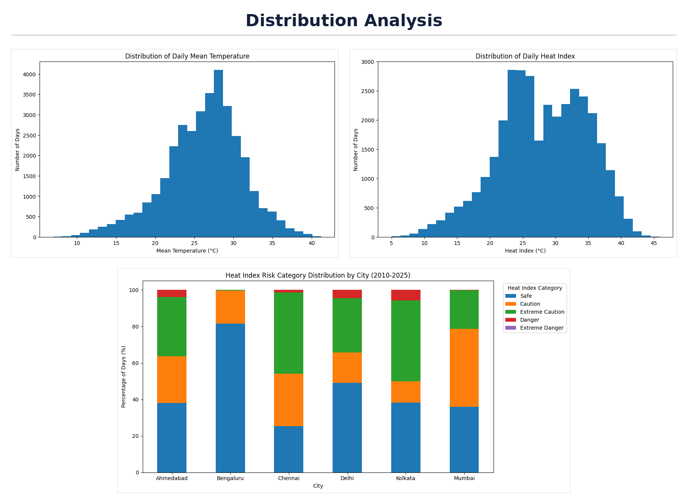
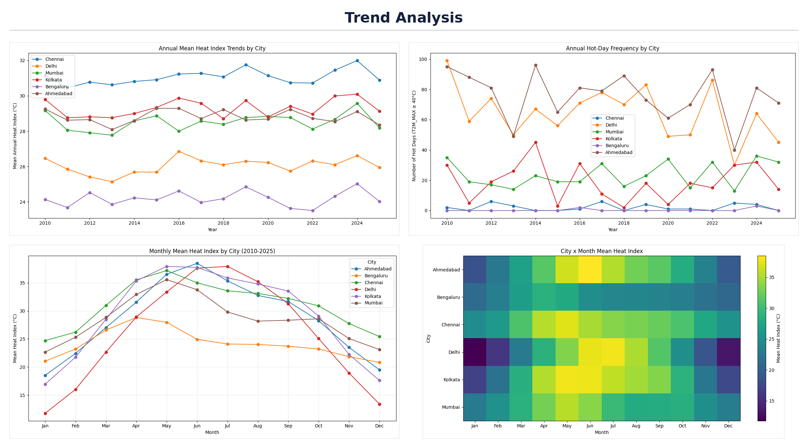
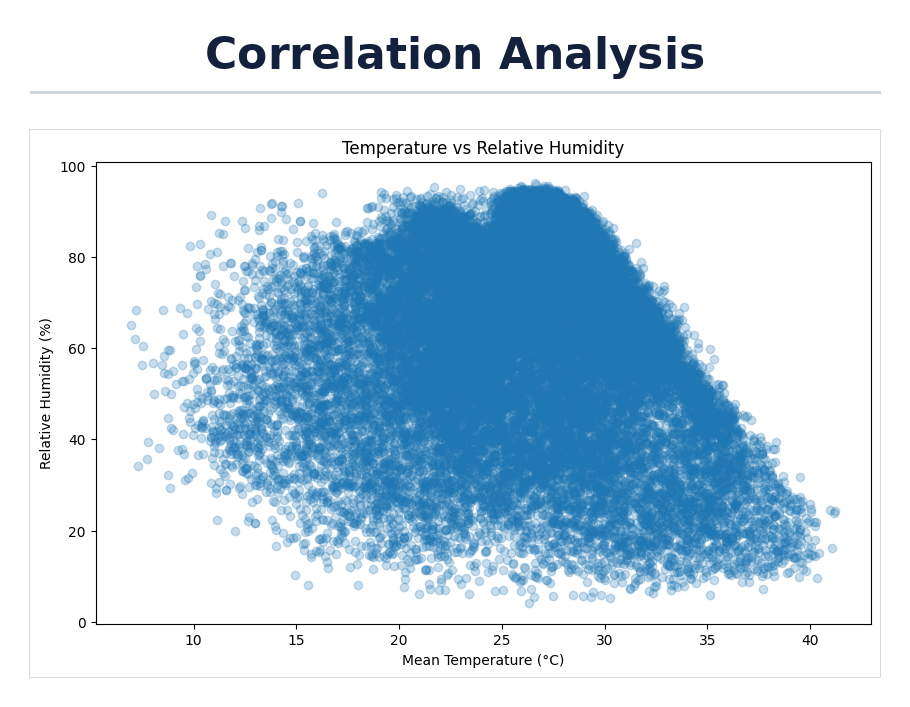

# Heat Stress Mapping of Indian Metro Cities

**Humidity-adjusted heat-risk analysis of six Indian cities (2010–2025) using Python**

## Industry

Climate & Environmental Analytics

## Problem Statement

Heat risk is usually judged by air temperature alone. Humidity limits sweat evaporation, so equally hot days can be far more dangerous in humid cities. A temperature-only view can therefore misrank cities and misdirect heat alerts, preparedness and public-health resources. City residents (especially outdoor workers, the elderly and children), city planners and health authorities are affected.

## Proposed Solution & Analysis Questions

Compute a humidity-adjusted **NWS Heat Index** for six climate-diverse Indian cities, classify every day by risk level, and compare it with temperature-only measures to show where heat stress is truly highest.

Questions answered through the analysis:

1. Which city has the highest share of Danger-level days?
2. Does a temperature-only ranking match the humidity-adjusted ranking?
3. In which months and seasons does heat stress peak in each city?
4. Is heat stress or hot-day frequency changing from 2010 to 2025?
5. Does the Heat Index agree with wet-bulb temperature?

## Dataset

| Item | Details |
|---|---|
| **Name** | NASA POWER daily point data (MERRA-2), one file per city |
| **Source** | [NASA POWER Data Access Viewer](https://power.larc.nasa.gov/data-access-viewer/) |
| **Cities** | Ahmedabad, Bengaluru, Chennai, Delhi, Kolkata, Mumbai |
| **Period** | 1 Jan 2010 – 31 Dec 2025 (daily) |
| **Original files** | 6 NASA POWER CSV files in `Dataset/raw_datasets/` (5,844 daily records each, with a 16-line metadata header) |
| **Cleaned dataset** | `cleaned_dataset.csv`: 35,064 rows × 13 columns |
| **Format** | CSV |

**Raw parameters:** `RH2M` (relative humidity), `T2M` (mean temperature), `T2M_MAX`, `T2M_MIN`, `T2MDEW` (dew point), `T2MWET` (wet-bulb temperature), `WS2M` (wind speed), `PRECTOTCORR` (precipitation), plus `YEAR`, `DOY` and the added `city` column.

**Cleaned columns:** `year`, `day_of_year`, `humidity`, `temperature`, `max_temperature`, `wet_bulb_temperature`, `city`, `date`, `month`, `season`, `heat_index`, `hi_category`, `hot_day`.

## Tools & Technologies

- Python
- Jupyter Notebook
- NumPy
- Pandas
- Matplotlib
- SciPy

## Project Workflow

**Industry Selection → Problem Identification → Dataset Collection → Data Cleaning → Data Transformation → Data Analysis → Data Visualization → Insights → Recommendations**

- **Data Collection (`data_loading.py`):** loads the six NASA POWER files.
- **Data Cleaning (`data_cleaning.py`):** renames columns, drops unused ones, and checks for missing (−999) values, duplicates and date gaps.
- **Data Transformation (`data_cleaning.py`):** builds `date`, `month` and `season` (Summer = Mar–Jun, Monsoon = Jul–Sep, Post-Monsoon = Oct–Nov, Winter = Dec–Feb), the NWS Heat Index, its risk category, and a `hot_day` flag (maximum temperature ≥ 40°C).
- **Data Analysis (`exploratory_analysis.py`):** summary tables, rankings and trend tests.
- **Data Visualization (`data_visualization.py`):** the three figures shown below.

## Data Analysis & Visualization

**Analysis performed**

- **Distribution analysis:** daily mean temperature, Heat Index, and Heat Index by city
- **Relationship and correlation analysis:** temperature vs. relative humidity; Heat Index vs. wet-bulb temperature
- **Category-wise analysis:** share of days in each Heat Index risk category per city
- **Comparison analysis:** hot days (≥ 40°C) vs. humidity-adjusted Danger days, with rankings
- **Time-based analysis:** monthly and seasonal Heat Index, annual Heat Index and hot-day trends (linear regression, α = 0.05)

**Visualizations (Matplotlib)**

| Figure | Contents |
|---|---|
| `distribution_analysis.png` | Temperature histogram, Heat Index histogram, Heat Index boxplot by city |
| `trend_analysis.png` | Annual mean Heat Index, annual hot days, monthly Heat Index, city × month heatmap |
| `correlation_analysis.png` | Temperature vs. humidity scatter |

## Key Insights

| City | Hot days (≥ 40°C) | Danger days | Temperature rank | Heat Index rank |
|---|---|---|---|---|
| Kolkata | 5.18% | 5.72% | 4 | 1 |
| Delhi | 17.64% | 4.48% | 2 | 2 |
| Ahmedabad | 20.74% | 3.95% | 1 | 3 |
| Chennai | 0.56% | 1.30% | 5 | 4 |
| Mumbai | 6.47% | 0.17% | 3 | 5 |
| Bengaluru | 0.09% | 0.00% | 6 | 6 |

- **Kolkata** has the highest share of Danger days (5.72%) and the highest peak Heat Index (45.85°C), although it ranks 4th by hot days.
- **Ahmedabad** leads on hot days (20.74%) but ranks 3rd on Danger days, so **temperature alone misranks heat risk**.
- **Chennai** has almost no 40°C days (0.56%) yet the highest mean Heat Index (31.06°C); about 75% of its days are above the Safe category.
- **Delhi** peaks in July (37.91°C); its Danger-day share is 10.05% in the monsoon vs. 5.84% in summer.
- **Peak Heat Index months:** Kolkata, Chennai and Mumbai in May; Ahmedabad in June; Delhi in July; Bengaluru in April.
- **Bengaluru** has no Danger days and 81.6% Safe days.
- Heat Index and wet-bulb temperature correlate at **0.89**.
- **No statistically significant trend** (p ≥ 0.05) in annual Heat Index or hot days in any of the six cities for 2010–2025 (closest: Chennai, +0.039°C/year, p = 0.081).
- No day reached the Extreme Danger category.

## Recommendations

- Report humidity-adjusted measures (Heat Index or wet-bulb temperature) alongside air temperature in heat alerts.
- Prioritize Kolkata, Delhi and Ahmedabad for Danger-day preparedness.
- Extend Delhi's heat advisories into the humid monsoon months.
- Plan year-round heat awareness for Chennai.

## Limitations

- NASA POWER/MERRA-2 values are gridded model estimates, not station readings, and may not capture neighborhood-scale urban heat.
- The Heat Index uses daily mean temperature and humidity, so it does not capture within-day peaks, solar radiation, wind, acclimatization or exposure duration.
- Hot days are a temperature threshold, not a duration-based heatwave definition.
- Season boundaries are a simplification, and 16 years is short for long-term trend conclusions.

## Visualization Screenshots

### Distribution Analysis



### Trend Analysis



### Correlation Analysis



## Project Folder Structure

```text
Heat-Stress-Mapping-of-Indian-Metro-Cities/
│
├── README.md
│
├── dataset/
│   ├── cleaned_dataset.csv
│   └── raw_datasets/
│       ├── Ahmedabad.csv
│       ├── Bengaluru.csv
│       ├── Chennai.csv
│       ├── Delhi.csv
│       ├── Kolkata.csv
│       └── Mumbai.csv
│
├── notebook/
│   └── heat_stress_analysis.ipynb
│
├── python/
│   ├── data_loading.py
│   ├── data_cleaning.py
│   ├── exploratory_analysis.py
│   └── data_visualization.py
│
├── visualizations/
│   ├── distribution_analysis.png
│   ├── trend_analysis.png
│   ├── correlation_analysis.png
│   ├── heat_index_risk_category_distribution_by_city_(2010-2025).png
│   ├── monthly_mean_heat_index_by_city_(2010-2025).png
│   ├── annual_mean_heat_index_trends_by_city.png
│   ├── annual_hot-day_frequency_by_city.png
│   ├── city_x_month_mean_heat_index.png
│   ├── heat_index_distribution_by_city.png
│   ├── distribution_of_daily_heat_index.png
│   ├── temperature_vs_relative_humidity.png
│   └── distribution_of_daily_mean_temperature.png
│
└── documentation/
    └── project_report.pptx
```

## How to Run

Install the libraries:

```bash
pip install pandas numpy matplotlib scipy jupyter
```

**Option 1: Python scripts.** Run these from inside the `python/` folder, in order:

```bash
python data_loading.py
python data_cleaning.py
python exploratory_analysis.py
python data_visualization.py
```

**Option 2: Notebook.**

```bash
jupyter notebook notebook/heat_stress_analysis.ipynb
```

The scripts read the original NASA files from `dataset/raw_datasets/`, create `dataset/cleaned_dataset.csv`, and save the figures to `visualizations/`.

## Documentation

The full project report is in [`documentation/project_report.pptx`](documentation/project_report.pptx).

## Author

- **Name:** Dhanaraj A
- **Student ID:** AF05309843
- **Organization:** Anudip Foundation
- **Course:** AIML
- **Batch Code:** ANP-D7444